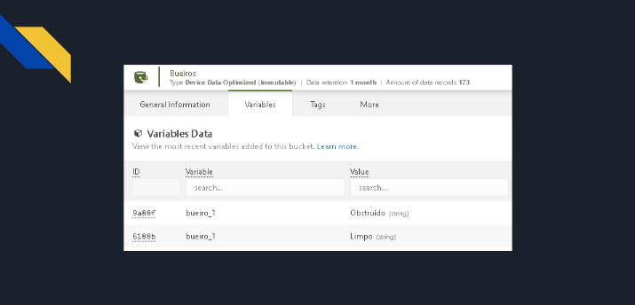

## Desenvolvimento e Entrega da Sprint 4 - Edge Computing and Computer Systems - Challenge 2023 :rooster:

**Nomes + RM dos integrantes:**
- Guilherme Akio - 98582
- Matheus Motta - 550352
- Guilherme Morais - 551981
- Fabrício Saavedra - 97631	
- Vinicius Buzato - 99125

**Turma:** 1ESPW

**Ano:** 2023
___

### Descrição do Projeto
Nesta estapa final do desafio proposto pela IBM, na matéria de Edge Computing, fizemos a alteração do método de comunicação realizado entre circuito físico e plataforma online para recebimento de dados, onde passamos a utilizar o método de comunicação MQTT visto em sala de aula para envio dos dados lidos pelos sensores.
___
### Desenvolvimento do projeto
Esta etapa do projeto foi desenvolvida a partir do circuito e sistemas já apresentados [neste repositório](https://github.com/Edge-Computing-1ESPW-Grupo-6/EdgeComputingComputerSystems_Sprint3.git), com a inclusão de conectividade com a internet e a integração com uma plataforma IoT gratuita que atendesse as necessidades do projeto, a [TagoIO](https://tago.io). 

O objetivo é que os dados obtidos pelos sensores físicos continuem a ser enviados para a internet e armazenadas na plataforma Tago, podendo assim ser manuseadas e analisadas conforme necessário, mas dessa vez utilizando o método de comunicação MQTT já mencionado. Para isso, foi preciso fazer um ajuste na estruturação do código e na própria plataforma Tago para se adaptar a esse novo meio de comunicação.

___

### Funcionamento do projeto
O funcionamento do projeto segue os mesmos passos do outro repositório já mencionado:
1. O [circuito](./imgs/Circuit_Sketch.png) é montado e instalado na entrada de um bueiro localizado em vias urbanas com recorrência de enchentes e alagamentos;
2. O sensor de proximidade faz a leitura constante do espaço onde se encontra instalado;
    - A leitura padrão está configurada para um espaço de 50cm, tamanho médio da entrada de um bueiro, mas pode ser ajustada de acordo com a necessidade.

3.  A leitura feita pelo sensor é enviada para a plataforma Tago através de comandos específicos no [código](Codigo_Arduino.ino) do programa arduino, que levam em conta o endereço WEB da plataforma tago bem como o código token de um dispositivo virtual criado na plataforma, para que a leitura possa ser armazenada nas variáveis desse dispositivo;
    - Essas leituras e suas respecitvas variáveis são apresentadas em forma de um dashboard-display, função já inclusa na plataforma Tago, indicando o estado atual do bueiro verificado (se está obstruido ou não);
    - Importante notar as mudanças no código em relação ao outro repositório, uma vez que aqui ele está adatpado ao método de comunicação MQTT;

4. Ao detectar a presença de um objeto na área escaneada, o sensor irá emitir alertas, indicando que algo se encontra obstruindo a entrada do bueiro;
    - Um alerta é enviado para o programa, que o leva em consideração ao calcular a chance de um alagamento.
    - Um alerta é enviado para órgãos públicos responsáveis pela limpeza das ruas, junto com a localização do bueiro monitorado, de modo que eles possam agir na área impactada.

Após a remoção o objeto detectado na entrada do bueiro, o sensor continua sua leitura.
___
### Como executar o projeto
  Para executar o projeto serão necessários:
  - Arduino (juntamente com o código presente [neste arquivo](Codigo_Arduino.ino) - anexa também sua [versão em txt](Codigo_Arduino.txt))
  - Acesso a plataforma [TagoIO](https://tago.io) - Para estabelecer a estrutura online do sistema IoI aqui desenvolvido - bem como conhecimento básico sobre seu funcionamento e sobre os conceitos de IoT.
     - O dispositivo na plataforma Tago deve ser ajustado adequadamente para receber os dados do circuito via protocolo MQTT. Os passos a serem seguidos para tais ajustes se encontram neste [Vídeo Explicativo](https://www.loom.com/share/43b9713dfc124fd494703b99fdfbaff1?sid=0248a9c3-4209-4ef8-978e-6f210997252e)
  
E também será necessário um kit básico de componentes físicos do Arduino, dos quais serão utilizados:
<table align=center>
  <tr>
    <td><b>Componente</b></td>
    <td align=center><b>Quantidade</b></td>
  </tr>
    <tr>
    <td>Placa ESP32*</td>
    <td align=center>1</td>
  </tr>
  <tr>
    <td>Sensor de distância ultrassonico</td>
    <td align=center>1</td>
  </tr>
  <tr>
    <td>Cabos jumpers</td>
    <td align=center>-</td>
  </tr>
    <tr>
    <td>Cabo USB-Micro USB</td>
    <td align=center>1</td>
  </tr>
</table>

Para a montagem do circuito, é necessária fazer a ligação do seansor de distância na placa ESP32 de forma adequada, e conectar a placa em uma porta USB de um computador (através de um cabo USB-Micro USB). 

Para execução, basta inserir o [código de execução](Codigo_Arduino.ino) no programa Arduino IDE e fazer o upload.

<strong>Atenção:</strong> é necessário um aparelho de roteamento de conexão WiFi por perto, bem como ajustar as linhas 5 e 6 do código com o nome e senha da rede fornecida pelo aparelho, de modo que a placa ESP32 consiga se conectar com a internet e enviar os dados para a plataforma.

*A placa ESP32 não é inclusa em kits básicos do arduino e deve ser adquirida a parte. A conexão de outros componentes com a placa deve ser feita corretamente levando-se em conta cada tipo de pino presente na placa. É possível utilizar [esta referência](./imgs/ESP32-Pinout.jpg) para auxílio na montagem.
___
### Pré-requisitos
Para execução do projeto é necessária experiência com o uso do programa Arduino e de seus componentes físicos, conhecimento básico da linguagem C++ para entendimento do código e ajustes necesários, conhecimento básico dos conceitos de IoT e conhecimento básico de usos da plataforma Tago
___
### Links relacionados
  [Vídeo Explicativo do Projeto](https://drive.google.com/file/d/1ef7AVcTwA-g2TXstnB8Lqaa6P-KBTt9M/view?usp=sharing)
